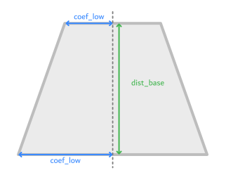

# Stellar Engine Alpha 0.1

Salut tout le monde,

Je vous annonce à vous ainsi qu'aux alpha testeurs la sortie en alpha privée de la version 0.1 de Stellar Engine. Cette première version a pour but d'obtenir un retour sur les premières fonctionnalités du moteur ainsi que sur les éventuels bugs à patcher ou améliorations à faire. Je vais donc tâcher d'expliquer aux alpha testeurs le fonctionnement de l'app ainsi que les consignes de test le plus clairement possible. 

Je vais donc y aller par point:

## Comment sortiront les alpha à venir de Stellar Engine?

Le système et le rythme de publication seront relativement simples : le développement se segmente par milestones, à chaque fin de milestone (dont le but sera d'apporter un certain nombre de fonctionnalités au moteur) nous sortirons une version testable du moteur pour les alpha testeurs afin qu'ils l'essaient et que l'on puisse présenter les avancées majeures du projet. 

Les programmes alphas seront publiés a deux endroits : sur le serveur Stellar Engine, dans l'espace Bêta Testers, ainsi que sur le serveur OurGames de Loïc Tomatot, partenaire de ce projet. Via le serveur Stellar Engine dans l'espace Bêta Testers, des zip seront mis a disposition en fonction de la version et du système d'exploitation .Via le serveur OurGames qui est partenaire Discord Developer, vous pourrez profiter de l'installateur Discord. [Vous pouvez rejoindre le serveur OurGames en cliquant ici](https://discord.gg/gmwk6yebY3).

## Comment dois-je utiliser l'application?

L'application actuelle n'ayant pas encore d'interface utilisateur, elle se repose principalement sur le langage json pour la configuration. Vous aurez donc à disposition un fichier `config.json` qui se situera dans le path de l'application, ce fichier contiendra tout ce dont l'application a besoin être configuré comme vous le souhaiterez.

### Fichier de configuration - Configuration des formes

Le fichier json permet de spécifier par exemple une forme que vous souhaitez afficher. Prenons une simple sphère avec un rayon à définir, il suffit de se rendre dans le fichier `config.json` d'y écrire:

```json
{
"shape":{
   "type":"sphere",
   "radius": 5
  }
}
```

Félicitations! Vous venez de créer votre première figure avec Stellar Engine ! Dans cette configuration, l'ensemble se trouve dans l'objet `shape`. Le `type` de la forme dans cette ensemble est `sphere`.

Gardez en tête que toutes les fonctions de distances sont exécutées avec des valeurs par défaut, il n'est donc pas nécéssaire de leur attribuer tous les paramètres systématiquement.

L'exemple précédent est minimaliste mais il existe un nombre très importants de configurations possibles. Ces configurations se départagent en trois catégories : les [formes](#les-formes), les ["modifiers"](#les-modifiers) et les [combinateurs](#les-combinateurs).

#### Les formes


#### Les modifiers

Les fonctions de modification (modifiers) permettent de modifier le comportement d'un ensemble.
Reprenons par exemple la sphere, appliquons une fonction "modifier" sur la sphere par exemple `repetition` qui a pour effet de répéter l'ensemble (ici la sphère) indéfiniment dans un espace défini par l'utilisateur. La configuration de ce dernier vous paraitra aussi simple que de définir une sphère :

```json
{
    "shape": {
        "type" : "repetition",
        "period" : [6,6,6],
        "instance" : {
            "type": "sphere",
            "radius": 1
        }
    }
}
``` 

Ici nous avons tout bêtement encapsulé sphere dans l'objet repetition, sphere devient donc une instance de notre fonction modifier. Notez que  comme l'objet sphere, les modifiers possèdent eux aussi leurs propres paramètres, précisé dans la partie [API JSON](#api-json). Gardez juste en tête que les modifier permettent d’interagir avec les fonctions de distance et de modifier leurs apparence/structure

#### Les combinateurs

Les combinateurs sont des fonctions dont l'intérêt et l'objectif et d'associer deux fonctions de distances avec une fonction combinatoire pour créer un nouvel ensemble.
```json
  {
        "shape" : {
            "type" : "union",
            "instance1" : {
                "type": "sphere",
                "radius": 1
            },
            "instance2" : {
                "type": "box",
                "radius": 15
            }
        }   
    }
```
Le fonctionnement reste sensiblement le même que les modifiers : les fonctions combinatoires nécessitent deux ensembles, un dans chacun des attributs `instance1` et `instance2`. Selon la fonction, l'ordre peut etre important, comme pour `intersection` et `difference`

#### Exemple

Voici un exemple comportant chacune des catégories pour former une forme complexe.
```json
{
    "shape" : {
        "type" : "union",
        "instance1":{
            "type": "displacement",
            "instance1" : {
                "type": "sphere",
                "radius": 8
            },
            "instance2":{
                "type" : "perlin",
                "frequency": 0.5
            }
        },
        "instance2" : {
            "type": "displacement",
            "instance1":{
                "type": "repetition",
                "period": [4.5, 4.5, 4.5],
                "instance":{
                    "type": "sphere",
                    "radius": 1
                }
            },
            "instance2":{
                "type": "simplex",
                "frequency": 1.0
            }
        }
    }
}
```
Comme vous pouvez le constater les possibilités sont larges. Il est possible d'imbriquer sans limite les différentes formes, modifier et combinateurs pour créer toute sorte de formes, l'exemple ci-dessus génère un rendu évoquant une planète avec un amas d'astéroides, mais comme vous l'aurez compris le résultat peut être autrement différent selon votre créativité et ce que vous combinez.

Désormais, ce sera à vous de tester cette interface et de nous retourner votre expérience.

### Fichier de configuration - Configuration de l'application

En plus du paramètre `shape`, le paramètre (optionnel) `app` permet de configurer le comportement du programme. Il est possible de changer le nombre de threads pour la génération de points, la génération des meshes, modifier la distance d'affichage et le mode de génération.

Il existe 4 modes de générations : 

- "smooth"          : génération lisse, normal des faces lisse
- "smooth_flat"     : génération lisse, normal des faces plate
- "cube"            : génération cubique, normal des faces lisse
- "cube_flat"       : génération cubique, normal des faces plate

```json
{
    "shape": {
        //...
    },
    "app" : {
        "num_thread_gen_point": 8,
        "num_thread_gen_mesh": 4,
        "container_distance": 2,
        "generation_mode": "smooth_flat"
    }
}
```

## API Json

A l'heure actuelle, Stellar Engine se propose différentes fonctions de distances pour permettre des rendus de forme/bruits/fractales, tout ceci pourra être utilisé et affiché avec la configuration json. Voici une description technique de comment définir le fichier `config.json` :

### Description technique du fichier :

```
Légende : 
#...    : Sous partie
?...    : parametres optionnel
(...)   : Détails/commentaire
...|... : l'un ou l'autre


#configuration : {
    "shape" : #ensemble,
    ?"app" : #app-paramètres
}

#ensemble : {
    "shape": "#type",
    #paramètres
}

#type : (voir plus bas la liste des types disponible)

#paramètres : #paramètres-shape | #paramètres-modifier | #paramètres-combinator

#paramètres-shape : (voir les paramètres spécifique aux objets plus bas)

#paramètres-modifier : "instance": #ensemble, (voir les paramètres spécifique aux objets plus bas)

#paramètres-combinator : "instance1": #ensemble, "instance2": #ensemble, (voir les paramètres spécifique aux objets plus bas)

#app-paramètres : {
    "num_thread_gen_point": (number),
    "num_thread_gen_mesh": (number),
    "container_distance": (number),
    "generation_mode": #generation_mode
}

#generation_mode : "smooth" | "smooth_flat" | "cube" | "cube_flat"

```

### Fonctions de distance disponibles

***Note*** : tous les paramètres sont optionnels à l'exception de "instance" pour les modifiers et de "instance1" et "instance2" pour les combinateurs.

<u>**Catégorie Shapes**</u>

**box**

Forme de boite

Paramètres:

| nom | type | valeur défaut | description |
| - | - | - | - |
| size | vecteur |[0.5,0.5,0.5]| taille de la boite |

**sphere**

Forme sphérique (pas elipsoïdale !)

Paramètres:

| nom | type | valeur défaut | description |
| - | - | - | - |
| radius | nombre | 0.5 | rayon de la sphère |

**polygon**

Forme de polygon. Utilisable que sur 2 dimensions.

Paramètres:

| nom | type | valeur défaut | description |
| - | - | - | - |
| ngon | nombre entier | 5 |nombre de point du polygone (Pour faire un pentagone, ngon=5)|

**plane**

Plan sans limite. Fonctionne sur l'equation de plan `ax + by + cz + d = 0` où [a,b,c] étant défioni par la `normal`, et `d` par la `distance`

Paramètres:

| nom | type | valeur défaut | description |
| - | - | - | - |
| normal | vecteur |[1,0,0]| normal du plan |
| distance | nombre | 0 | distance du plan par rapport à la normal |

**round_box**

Forme de boite aux bords arrondis. Equivalent à une `box` imbriqué dans un `round`

Paramètres:

| nom | type | valeur défaut | description |
| - | - | - | - |
| size | vecteur |[0.5,0.5,0.5]| Taille de la boite |
| radius | nombre | 0.1 | Rayon des coins arrondis |

<u>**Catégorie Noises**</u>

**perlin**

Bruit de perlin

Paramètres:

| nom | type | valeur défaut | description |
| - | - | - | - |
| octaves | nombre entier | 1 | Nombre d'octaves |
| frequency | nombre | 1.0 | Fréquence de base |
| persistence | nombre | 0.75 | ratio d'evolution de l'amplitude à chaque octave |
| lacunarity | nombre | 2.0 | ratio d'evolution de la fréquence à chaque octave |

**simplex**

Bruit Simplex. Similaire au bruit de perlin avec une meilleure performance sur dimension supérieurs à 2.

Paramètres:

| nom | type | valeur défaut | description |
| - | - | - | - |
| octaves | nombre entier | 1 | Nombre d'octaves |
| frequency | nombre | 1.0 | Fréquence de base |
| persistence | nombre | 0.75 | ratio d'evolution de l'amplitude à chaque octave |
| lacunarity | nombre | 2.0 | ratio d'evolution de la fréquence à chaque octave |

**voronoi**

Bruit cellulaire de worley.

Paramètres:

| nom | type | valeur défaut | description |
| - | - | - | - |
| randomness | nombre | 1.0 |coeficient de dispersion aléatoire du centre des points.|
| output | 0: couleur, 1: distance | 1 |Type de résultat. Couleur unique par point ou distance du point le plus proche.|

<u>**Catégorie Modifiers**</u>

Paramètres communs: 

| nom | type | description |
| instance | ensemble |L'ensemble à modifier.|

**repetition**

Répète l'ensemble.

Paramètres:

| nom | type | valeur défaut | description |
| - | - | - | - |
| period | vecteur |[1,1,1]|distance entre chaque répétition.|

**elongate**

Allonge la forme 

Paramètres:

| nom | type | valeur défaut | description |
| - | - | - | - |
| distance | vecteur |[0,0,0]| distance d'allongement par dimension |
| quality | nombre entier | 0 | 0: méthode rapide, 1: méthode standard |

**mirror**

Créer une symétrie de l'ensemble sur les dimension `axis`

Paramètres:

| nom | type | valeur défaut | description |
| - | - | - | - |
| axis | vecteur booléen |[0,0,0]| 0: pas de symétrie, 1: symetrie sur l'axe |

**onion**

Créer des couches intérieures de taille `thickness` allant jusqu'au centre de l'ensemble

Paramètres:

| nom | type | valeur défaut | description |
| - | - | - | - |
| thickness | nombre | 0.1 | epaisseur des couches |

**round**

Arrondir la forme

Paramètres:

| nom | type | valeur défaut | description |
| - | - | - | - |
| radius | nombre | 0.1 |rayon de l'arrondissement. Note: l'objet va grossir d'une distance de rayon.|

**transform**

Matrice de transformation à appliquer à l'ensemble.

Paramètres:

| nom | type | valeur défaut | description |
| - | - | - | - |
| transforms | tableau |[]|liste de transformation à appliquer, dans l'ordre.|

Liste des tranformation (sous forme de tuples) : 

`[translate, [x,y,z]]` : applique une translation

`[scale, [x,y,z]]` : applique un redimenssionnement

`[rotate, {"axe": [x,y,z], "angle": v}]` : applique une rotation de `v` radians sur l'axe `[x,y,z]`

Exemple: 
```json
{
    "type": "transform",
    "transforms": [
        ["translate", [0,1,2]],
        ["scale", [3,4,5]],
        ["rotate", {"axe": [1,0,0], "angle": 1.56}]
    ]
}
```

**extrude**

Créer une extrusion d'une forme à une dimension inférieure. Par exemple, une extrusion 3D d'un ensemble 2D.
Ce modifier est particulier car contrairement aux autres, l'instance attendue par l'extrude **doit** être d'une dimension inférieure.



Paramètres:

| nom | type | valeur défaut | description |
| - | - | - | - |
| coef_low | nombre |1.|coeficient de taille de la base basse |
| coef_high | nombre |1.| coeficient de taille de la base haute |
| dist_bases | nombre |1.| distance entre les deux bases |


<u>**Catégorie Combinateurs**</u>

Paramètres communs: 

| nom | type | description |
| - | - | - |
| instance1 | ensemble | Premier ensemble à assembler |
| instance2 | ensemble | Deuxième ensemble à assembler |

**intersection**

Intersection booléenne

Paramètres: 

| nom | type | valeur défaut | description |
| - | - | - | - |
| smooth | nombre | Pas de lissage | Lissage de la combinaison |

**difference**

Différence booléenne

Paramètres:

| nom | type | valeur défaut | description |
| - | - | - | - |
| smooth | nombre | Pas de lissage | Lissage de la combinaison |

**union**

Union booléenne

Paramètres:

| nom | type | valeur défaut | description |
| - | - | - | - |
| smooth | nombre | Pas de lissage | Lissage de la combinaison |

**displacement**

Déforme un ensemble avec un autre ensemble. La déformation est commutative (l'ordre des ensembles ne compte pas)

<u>**Catégorie Fractale**</u>

**mandelbrot**

Génère un ensemble de mandelbrot avec un nombre donné d'itérations (faisant varier le niveau de détails de la structure) de deux à quatres dimensions (algorithme de la mandelbulb pour 3 dimensions.

Paramètres:

| nom | type | valeur défaut | description |
| - | - | - | - |
| power | nombre | 8 en 3D, 2 en 2D |La puissance utilisée pour calculer les itérations de la fractale tel que Zn+1 = Zn^power + Z0.|
| iterations | nombre entier | 5 en 3D, 50 en 2D |Nombre d'itérations de l'ensemble (influe sur le niveau de détails).|